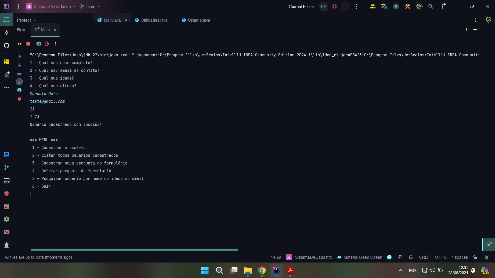

# Sistema de Gerenciamento de Usuários



> Sistema de cadastro feito em java que conta com algumas funcionalidades como abertura, leitura e criação de arquivos, princípios de POO e uso de exceções. 

### Funcionalidades

- **Cadastrar Usuários**
- **Listar Usuários Cadastrados**
- **Adicionar Perguntas ao Formulário**
- **Remover Pergunta do Formulário**
- **Pesquisar Usuários por Nome, Idade ou Email**

## 💻 Pré-requisitos

Antes de começar, verifique se você atendeu aos seguintes requisitos:

- Java JDK 8 ou superior
- IDE ou Editor de Texto para compilar e executar o código


## ☕ Como Usar

1. Clone o repositório:
   ```bash
   git clone https://github.com/MarceloMelo201/SistemaDeCadastro
   ```
2. Navegue até o diretório do projeto:
   ```bash
   cd SistemaDeCadastro
   ```
3. Compile e execute o projeto:
   ```bash
   javac application/Main.java
   java application.Main
   ```


## 📫 Contribuindo para <Sistema-De-Cadastro>

Para contribuir com <Sistema-De-Cadastro>, siga estas etapas:

1. Bifurque este repositório.
2. Crie um branch: `git checkout -b <nome_branch>`.
3. Faça suas alterações e confirme-as: `git commit -m '<mensagem_commit>'`
4. Envie para o branch original: `git push origin <SistemaDeCadastro> / <main>`
5. Crie a solicitação de pull.

Como alternativa, consulte a documentação do GitHub em [como criar uma solicitação pull](https://help.github.com/en/github/collaborating-with-issues-and-pull-requests/creating-a-pull-request).


## 📝 Licença

Esse projeto está sob licença. Veja o arquivo [LICENÇA](LICENSE.md) para mais detalhes.